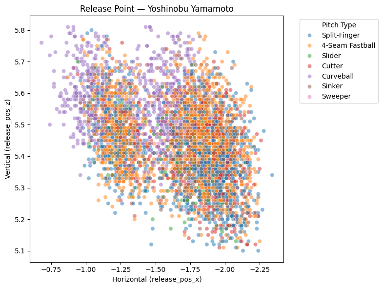
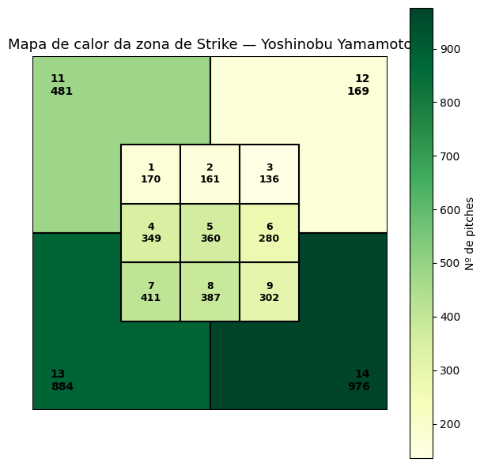
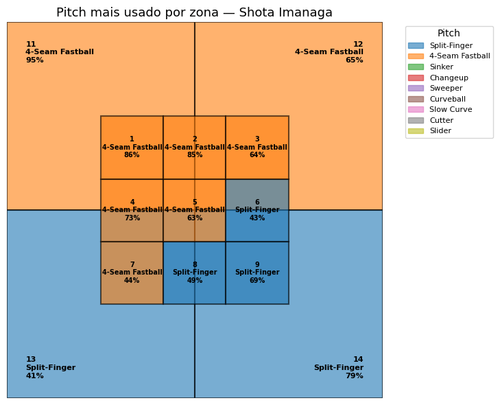
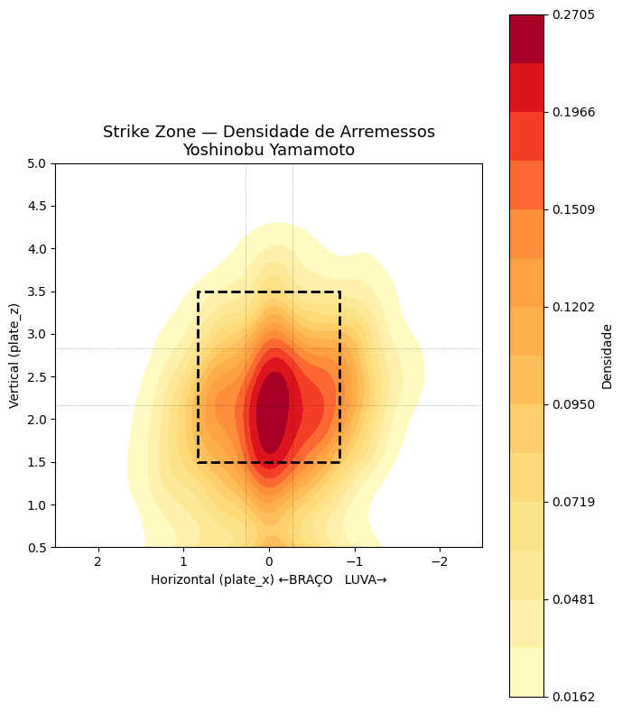
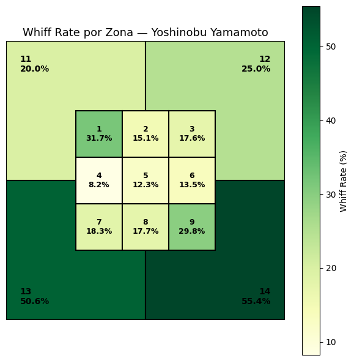
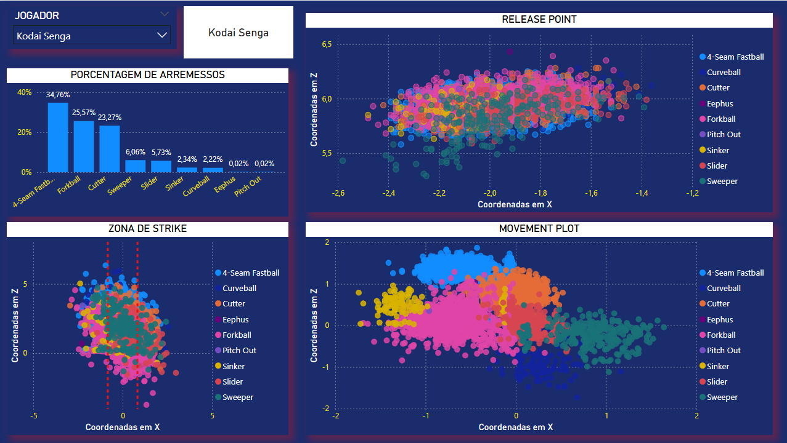

# MLB Pitching Analytics - Available in PT-BR / EN

## 🇧🇷 Português

## Visão Geral

Este projeto tem como objetivo analisar o desempenho de arremessadores da MLB utilizando ferramentas como SQL Server, Python e Power BI.

Os dados passaram por um processo de limpeza, padronização e validação no SQL Server antes de serem utilizados para análises exploratórias e construção de visualizações avançadas em Python e dashboards interativos no Power BI.

O foco do projeto foi investigar padrões de localização dos arremessos, eficiência por região da zona de strike e características individuais de cada pitcher.

## Ferramentas Utilizadas

* SQL Server
* Python
* Pandas
* Matplotlib
* Seaborn
* Power BI

---

## Preparação dos Dados

A base original continha inconsistências de escala e valores inválidos que precisaram ser tratados antes da análise.

Entre as etapas realizadas:

* Correção de unidades em variáveis numéricas
* Tratamento de valores ausentes
* Remoção de registros inválidos
* Padronização dos dados para análise
* Validação de métricas relacionadas a contato e velocidade da bola

Toda a etapa de limpeza foi realizada utilizando SQL Server.

## Análises Desenvolvidas

### Análise de release point

Visualização do ponto de soltura dos arremessos de um pitcher específico, com opção de filtragem por tipo de arremesso e remoção de outliers.

### Mapa de calor da zona de strike

Mapa de calor demonstrando a frequência de arremessos em cada região da zona de strike.

### Pitch dominante por zona

Identificação do arremesso mais utilizado em cada região da zona de strike.

### Análise de densidade de arremesso (KDE)

Visualização da densidade espacial dos arremessos utilizando estimativa de densidade por kernel (KDE).

### Whiff Rate por zona

Análise da taxa de swings no vazio (whiffs) por região da zona de strike.

---

## Dashboard Power BI

Além das análises em Python, foi desenvolvido um dashboard interativo no Power BI para consolidar métricas e facilitar a exploração dos dados.

## Principais Perguntas Investigadas

* Quais regiões da zona de strike geram maior taxa de whiffs?
* Onde os pitchers concentram seus arremessos?
* Como varia o release point entre diferentes tipos de arremesso?
* Qual é o pitch dominante em cada região da zona?
* Existem padrões claros de localização associados ao sucesso do arremessador?

---

## 🇺🇸 English

## Overview

This project analyzes MLB pitching performance using SQL Server, Python, and Power BI.

The dataset underwent data cleaning, standardization, and validation processes in SQL Server before being used for exploratory analysis, advanced visualizations in Python, and interactive dashboards in Power BI.

The primary objective was to investigate pitch location patterns, strike zone effectiveness, and pitcher-specific characteristics.

## Tools Used

* SQL Server
* Python
* Pandas
* Matplotlib
* Seaborn
* Power BI

---

## Data Preparation

The original dataset contained scaling inconsistencies and invalid values that required correction before analysis.

Key cleaning steps included:

* Unit normalization
* Missing value treatment
* Invalid record removal
* Data standardization
* Validation of contact and ball-tracking metrics

All preprocessing was performed in SQL Server.

---

## Analyses Performed

### Release Point Analysis

Visualization of pitcher release points with optional pitch-type filtering and outlier removal.

### Strike Zone Heatmap

Heatmap showing pitch frequency across different strike zone regions.

### Dominant Pitch by Zone

Identification of the most frequently used pitch type in each strike zone area.

### Pitch Density Analysis (KDE)

Spatial pitch density visualization using Kernel Density Estimation (KDE).

### Whiff Rate by Zone

Analysis of swing-and-miss rates across strike zone regions.

---

## Power BI Dashboard

An interactive Power BI dashboard was developed to consolidate pitching metrics and support data exploration.

## Key Questions Investigated

* Which strike zone regions generate the highest whiff rates?
* Where do pitchers concentrate their pitches?
* How does release point vary across pitch types?
* What is the dominant pitch in each strike zone region?
* Are there location patterns associated with pitching success?
